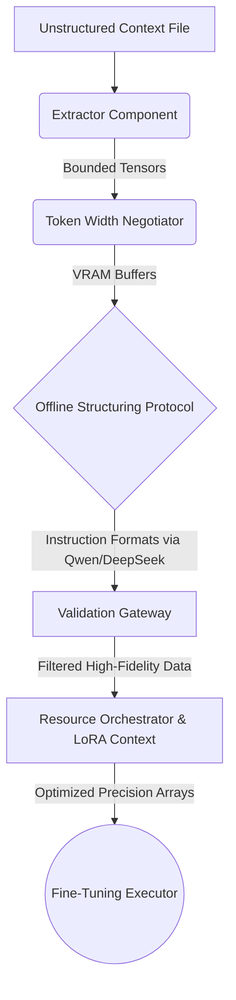

# ⚙️ Crineforge Technical Blueprint

This document illustrates the internal architecture routing mapping the **Crineforge** environment. Built firmly to prioritize factual validation pipelines across air-gapped runtimes, Crineforge abstracts data lifecycle modules.

---

## 🏗️ Crineforge Core Flow

---

## 1. Internal Processing Abstractions

### Context Extractor
Our internal extraction engine traverses complex layouts seamlessly. While the Community Edition provides raw text integration and bounded image traversal natively, strict structural algorithms ensure memory isn't leaked into uncontrolled buffers prior to validation.

### Token Width Negotiator
Responsibility falls strictly to chunk limits relative to target capacity buffers, injecting logical token overlaps safely to guard against semantic starvation or mid-sequence slicing.

### Offline Structuring Protocol *(The Intelligence Framework)*
- Leveraging Hugging Face capabilities natively, Crineforge mounts open-source intelligence models natively (`deepseek-llm-7b-chat` & `Qwen2.5-1.5B-Instruct`).
- Triggered exclusively offline. The framework loads target matrices directly into your local RAM/VRAM pools sequentially, processes chunks iteratively, and purges references proactively, utilizing robust garbage collection algorithms.
- **Why internal models?** Deploying models locally as structured tutors avoids API timeouts, zero-trust enterprise boundaries, and subscription fees for data curation.

### Validation Gateway
The core mechanism protecting the base model's loss trajectory from noisy formatting outputs.
- Parses generated outputs heuristically.
- Executes safe-recovery drop-logic on malformed arrays cleanly preventing crashes.
- Future **Pro & Enterprise validation meshes** integrate complex multi-agent swarms explicitly here to ensure 99.9% semantic fidelity bounds.

---

## 2. Resource Negotiation

### Auto-Profile Mapping
To prevent exhaustion loops during model loading, an automatic orchestration hook analyzes:
1. Base parameters sizes.
2. Graphic device capability (CUDA limits).
3. Modulates dynamic parameters including Batch constraints intuitively. 

### Distributed Connector 
- Orchestrates `bitsandbytes` memory integrations automatically enforcing reliable 4-bit targets on low-end arrays.
- Implements active Low-Rank Adapters globally ensuring gradients are managed independently from core weights. 

## 3. Commercial Extensions
The Community architecture detailed in this blueprint handles stable execution parameters. Further deep-dive integrations—involving heavy distributed RAG meshes, custom enterprise structurers, and swarm verifications—operate externally to the Community pipelines, ensuring optimal performance gradients exclusively.
